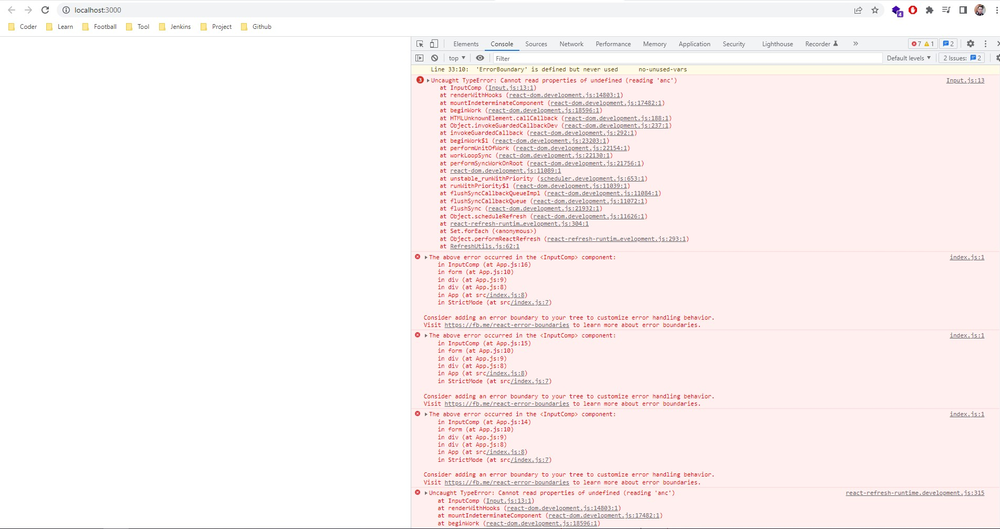
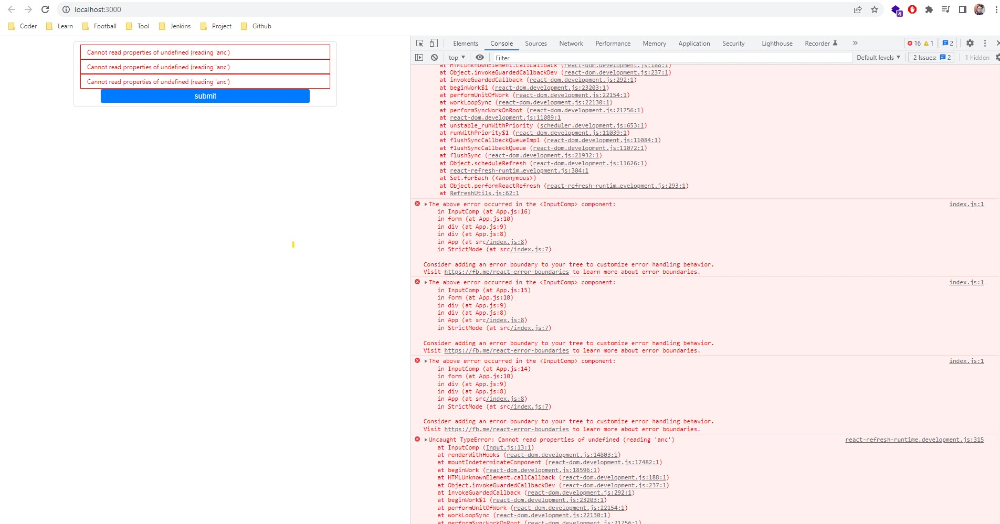

## React Error Boundary

Khi chúng ta phát triển phần mềm thì không tránh khỏi gặp bug gây crash chương trình, khiến cho người dùng không sử dụng được. Vậy khi khi một component nhỏ là 1 thành phần trang gây lỗi làm crash phần mềm mà không gây ảnh hưởng lớn toàn app, người dùng muốn thao tác các phần khác thì làm thế nào.

Chính vì thế react đã có cách xử lý đó là sử dụng React Boundary.

   https://reactjs.org/docs/error-boundaries.html

Hiện nay trên npm package đã có thư viện thay vì code tay theo trên trang chủ:

   https://reactjs.org/docs/error-boundaries.html

Ảnh minh họa:

Chưa sử dụng react error boundary



Sử dụng react error boundary



## CÀI ĐẶT

    npm install

## SỬ DỤNG

    npm start

Đoạn code ví dụ sử dụng react error boundary:

```javascript
import React from "react";
import { withErrorBoundary } from "react-error-boundary";

const InputComp = (props) => {
  const {
    type = "text",
    nameInput = "",
    placeholder = "Please Input Here",
    styles = {},
  } = props;

  return (
    <> 
      {/* Test show error */}
      {/* {props.nameInput.anc } */}
      <input
        style={{
          width: 450, 
          fontSize: 12,
          border: "1px solid #ddd",
          borderRadius: 4,
          padding: "5px 12px",
          marginBottom: 10,
          ...styles,
        }}
        type={type}
        name={nameInput}
        placeholder={placeholder}
      />
    </>
  );
};

function ErrorBoundary({ error }) {
  return (
    <div style={{ fontSize: 12, color: "red", border: "1px solid red",  padding: "5px 12px" }}>
      {error.message}
    </div>
  );
}

export default withErrorBoundary(InputComp, {
  FallbackComponent: ErrorBoundary,
});

```
